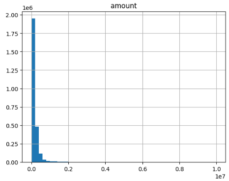
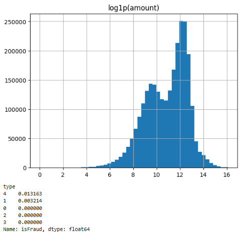
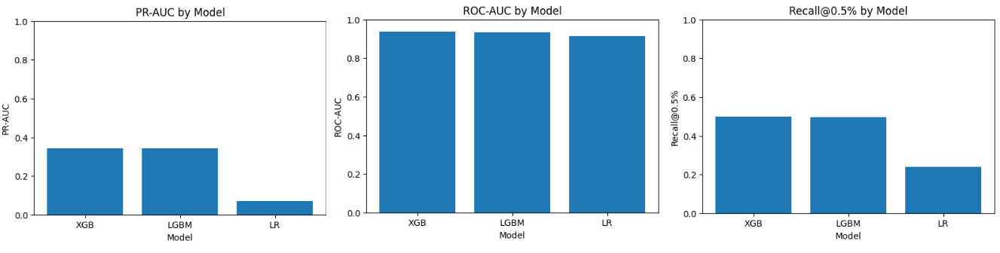
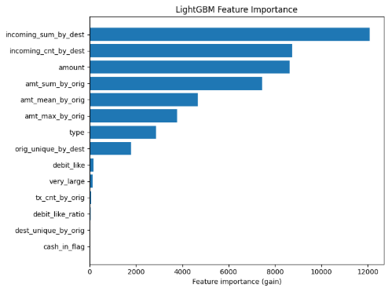
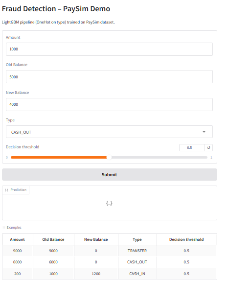

# Fraud Detection – PaySim Demo 🛡️  

🚀 [**Live Demo on Hugging Face**](https://huggingface.co/spaces/Kimete/fraud-detection)  

LightGBM pipeline (OneHot on type) trained on PaySim dataset.  
This project demonstrates **data preprocessing, model training, evaluation, and deployment** with Gradio on Hugging Face Spaces.  

---

## 📊 Project Overview  
Fraud detection is a classic challenge in financial transactions, especially when the data is highly imbalanced (fraud cases are very rare).  

This project includes:
- Exploratory Data Analysis (EDA)  
- Class imbalance handling (SMOTE / class_weight)  
- Training models: Logistic Regression, LightGBM, XGBoost  
- Hyperparameter tuning (GridSearchCV / Optuna)  
- Feature importance analysis (SHAP values)  
- Deployment with **Gradio + Hugging Face Spaces**  

---

## 📂 Dataset  
- **Source**: [PaySim](https://www.kaggle.com/datasets/ealaxi/paysim1)  
- **Size**: ~6.3 million transactions  
- **Features**:  
  - `amount`  
  - `oldbalanceOrg`  
  - `newbalanceOrig`  
  - `type` (OneHot encoded)  

Fraudulent transactions are usually observed when balances don’t match after **TRANSFER** or **CASH_OUT** operations.  

---

## 🔎 Exploratory Data Analysis (EDA)  
Transaction amounts are highly skewed.  
We apply a log transformation to balance the distribution:  

  
  

---

## ⚡ Model Training & Evaluation  
We tested **Logistic Regression, LightGBM, XGBoost**.  
LightGBM performed best overall.  

📊 **Performance metrics:**  

  

| Model               | PR-AUC | ROC-AUC | Recall@0.5% |
|---------------------|--------|---------|-------------|
| **XGBoost**         | 0.342  | 0.938   | 0.499       |
| **LightGBM**        | 0.344  | 0.933   | 0.495       |
| Logistic Regression | 0.061  | 0.916   | 0.239       |

---

## 🎯 Feature Importance  
The most influential features are:  
- Transaction amount  
- Old and new balances  
- Transaction type  

  

---

## 🚀 Deployment – Hugging Face Demo  
The trained pipeline is deployed as an interactive web app.  
Users can test transactions and adjust the decision threshold.  

  

---

## 💻 Run Locally  

To run the app on your machine:

```bash
# 1. Clone the repository
git clone https://github.com/Kimete-bit/fraud-detection.git
cd fraud-detection

# 2. (Optional) Create virtual environment
python -m venv venv
venv\Scripts\activate       # On Windows
# source venv/bin/activate  # On Linux/Mac

# 3. Install dependencies
pip install -r requirements.txt

# 4. Run the app
python app.py
